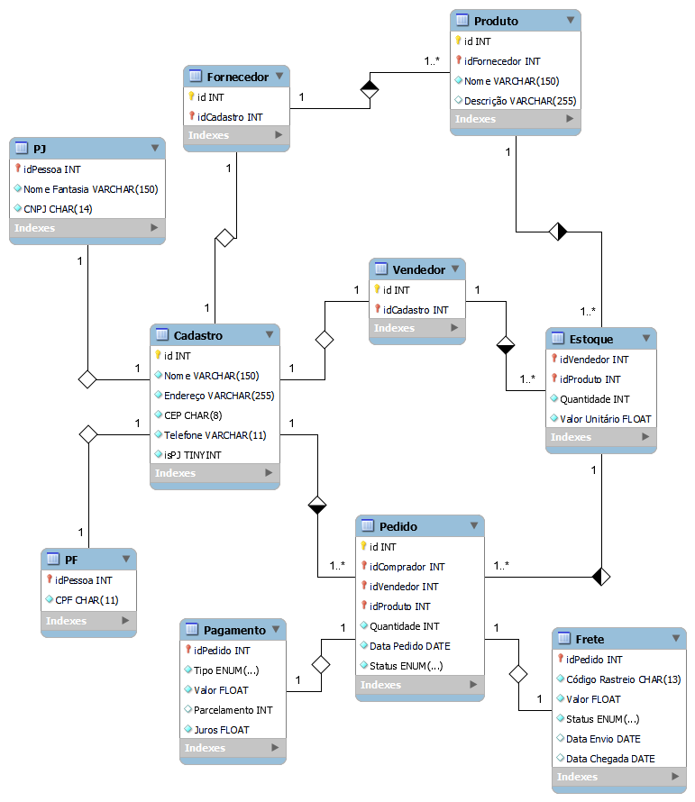

# Modelagem de Banco de Dados — E-commerce

Projeto acadêmico/de estudo para modelagem de um banco de dados relacional aplicado a uma plataforma de e-commerce.

## Contexto

O cenário considera uma plataforma com:

- clientes pessoa física ou jurídica;
- produtos;
- fornecedores;
- vendedores terceiros;
- pedidos;
- múltiplas formas de pagamento;
- entregas com status e código de rastreamento.

## Objetivos da modelagem

### Refinamento do modelo

- [x] Diferenciar clientes PF e PJ;
- [x] Permitir mais de uma forma de pagamento;
- [x] Representar entrega com status e código de rastreamento.

### Modelagem física e consultas

- [x] Consultas com `SELECT`;
- [x] Filtros com `WHERE`;
- [x] Atributos derivados;
- [x] Ordenação com `ORDER BY`;
- [x] Agrupamento com `GROUP BY`;
- [x] Filtros sobre grupos com `HAVING`;
- [x] Junções com `JOIN`;
- [x] Funções de agregação.

## Diagrama EER

## Estrutura do repositório

- `create-database.sql` — criação do schema;
- `insert-data.sql` — inserção de dados de exemplo;
- `query-database.sql` — consultas SQL;
- `diagrama-EER.png` — diagrama entidade-relacionamento.

## Exemplos de consultas

O projeto inclui consultas para:

- listar cadastros e clientes ordenados por nome;
- listar pessoas jurídicas;
- localizar produtos por fornecedor;
- consultar estoque por vendedor;
- listar pedidos por data;
- consultar pedidos com atributos derivados;
- consultar entregas por código de rastreamento;
- agrupar pedidos por status;
- agrupar vendas por produto e vendedor;
- identificar vendedores cujo total de vendas ultrapassa determinado valor.

## Conceitos praticados

`SQL` · `Modelagem Relacional` · `EER` · `JOIN` · `GROUP BY` · `HAVING` · `ORDER BY`

## Status

✅ Projeto acadêmico/de estudo concluído.
