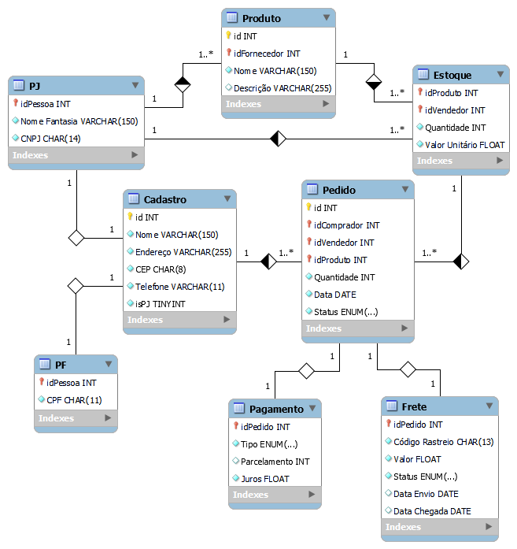

# E-commerce

 Desafio do curso "SQL Specialist" da DIO de modelagem de dados de um E-commerce.

## Requisitos:
- Os produtos são vendidos por uma única plataforma online. Contudo, estes podem ter vendedores distintos (terceiros).
- Cada produto possui um fornecedor.
- Um ou mais produtos podem compor um pedido.
- O cliente pode se cadastrar no site com seu CPF ou CNPJ.
- O endereço do cliente irá determinar o valor do frete.
- Um cliente pode comprar mais de um pedido. Este tem um período de carência para devolução do produto.
- O pedidos são criados por clientes e possuem informações de compra, endereço e status de entrega.
- Um produto ou mais compoem o pedido.
- O pedido pode ser cancelado.

## Objetivo do desafio:
- [x] Cliente PJ e PF - Uma conta pode ser PJ ou PF, mas não pode ter as duas informações.
- [x] Pagamento - Pode ter cadastrado mais de uma forma de pagamento.
- [x] Entrega - Possui status e código de rastreio.

## Diagrama EER:

